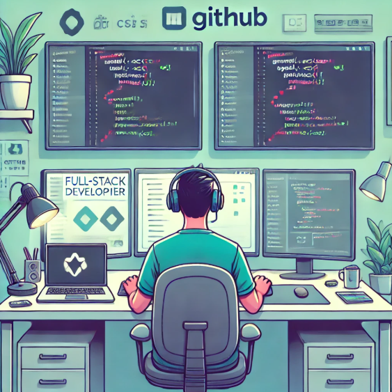

# 👨‍💻 Fullstack Developer 🚀

**Ruta de aprendizaje para convertirme en Desarrollador Full Stack, con proyectos organizados en Front-End, Back-End y aplicaciones completas.**

---

## 🧰 **Tech Skills**

### **Programming Languages**

  
  
  
  
  
  

  

### **Frameworks and Libraries**

  
  
  
  

### **Software and Tools**

  
  
  
  

---

## 🌐 **Languages**
- Español
- Inglés

---

## ✨ **About Me**
- 👋 Hi, I’m **Jhony Aldo**.
- 🌱 I’m a Full Stack Developer in progress.
- 💻 I’m looking to collaborate on projects related to **Web Development**.
- 📫 How to reach me: [jhonyaldo@gmail.com](mailto:jhonyaldo@gmail.com)
- 🌐 Visit my portfolio: [Portfolio Link](https://github.com/jhonyaldo)

---

## 🔗 **Socials**

  
  

---
